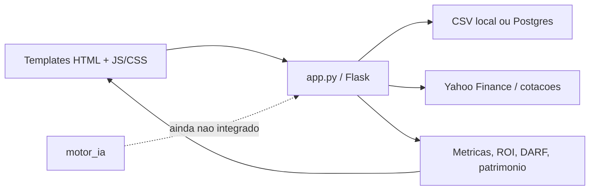

# Arquitetura V4 - Cortex Invest PRO

## Visao Geral

Este projeto e um monolito Flask para controle de operacoes da estrategia Wheel, chamado Cortex Invest PRO. A aplicacao inteira gira em torno de `app.py`, que concentra rotas, leitura e gravacao de dados, calculos financeiros, geracao de metricas e parte do HTML/CSS legado.

Fluxo principal:



## Camadas

### 1. Aplicacao Web

O nucleo esta em `app.py`. Ele cria o app Flask, registra as rotas e faz quase todo o trabalho de negocio.

Rotas principais:

- `/`: dashboard.
- `/nova`: cria operacao.
- `/editar/<oid>`: edita operacao.
- `/fechar/<oid>`: encerra operacao.
- `/excluir/<oid>`: remove operacao.
- `/reabrir/<oid>`: reabre operacao.
- `/operacoes-abertas`: lista operacoes abertas.
- `/op-fechadas`: lista operacoes encerradas.
- `/historico`: historico mensal.
- `/desempenho`: indicadores de desempenho.
- `/carteira`: visao consolidada da carteira.
- `/relatorios`: exportacoes.
- `/configuracoes`: parametros do sistema.
- `/backup`: central de backup.
- `/sobre`: informacoes do sistema.
- `/cotacao`: consulta cotacao via Yahoo.

### 2. Persistencia

Ha tres modos ou vestigios de persistencia:

- CSV local em `data/operacoes.csv`, `data/fechadas.csv` e `data/config.csv`.
- SQLite preparado em `data/cortex.db`, mas pouco usado no fluxo principal atual.
- Postgres/Neon ativado quando existe a variavel `DATABASE_URL`.

A arquitetura real hoje e: CSV local por padrao, Postgres em producao se configurado.

### 3. Regras de Negocio

As principais regras de negocio estao em `app.py`, especialmente nas funcoes:

- `enrich_ops`: enriquece operacoes com capital, premio liquido, ROI, dias ate vencimento, nota e alerta.
- `metrics`: calcula capital comprometido, caixa livre, premios, lucro mensal, DARF, ROI e totais.
- `monthly`: monta historico mensal de lucro, premios, DARF, ROI e patrimonio.

Essa logica ainda nao esta em uma camada separada de servicos.

### 4. Interface

A UI nova usa templates Jinja em `templates/`, com uma base compartilhada em `templates/base.html`.

Principais templates:

- `templates/dashboard.html`
- `templates/operacoes_abertas.html`
- `templates/configuracoes.html`
- `templates/historico.html`
- `templates/desempenho.html`
- `templates/carteira.html`
- `templates/relatorios.html`
- `templates/backup.html`
- `templates/sobre.html`

Os assets ficam em `static/`:

- `static/theme.css`
- `static/dashboard.js`
- `static/op_abertas.js`
- `static/search_filters.js`
- `static/theme.js`
- `static/favicon.svg`

Tambem existem arquivos HTML e CSS antigos na raiz, como `dashboard.html`, `theme.css` e `op_fechadas_v2_layout.html`. Eles parecem sobras ou versoes anteriores, nao o caminho principal usado pelo Flask.

### 5. Motor IA

Existe um modulo separado em `motor_ia/`, com score, ranking, configuracao, cache e providers Yahoo/Brapi.

Arquivos principais:

- `motor_ia/central.py`
- `motor_ia/score.py`
- `motor_ia/ranking.py`
- `motor_ia/configuracao.py`
- `motor_ia/cache.py`
- `motor_ia/explicacao.py`
- `motor_ia/providers/yahoo.py`
- `motor_ia/providers/brapi.py`

No estado atual, o modulo ainda parece embrionario e nao esta conectado as rotas do Flask. Tambem ha indicios de inconsistencias internas:

- `central.py` chama `calcular_score(op, PESOS)`, mas `score.py` define `calcular_score(metricas)`.
- `central.py` importa `ordenar_oportunidades`, mas `ranking.py` define `ordenar`.
- Os providers `YahooProvider` e `BrapiProvider` retornam listas vazias.

### 6. Deploy

O projeto esta preparado para Render via `render.yaml`.

Comando de build:

```txt
pip install -r requirements.txt
```

Comando de start:

```txt
gunicorn app:app --bind 0.0.0.0:$PORT
```

Dependencias principais em `requirements.txt`:

- Flask
- gunicorn
- psycopg2-binary
- yfinance

## Estrutura Atual

```txt
Flask monolitico
├── app.py
│   ├── rotas HTTP
│   ├── calculos financeiros
│   ├── acesso a CSV/Postgres
│   ├── consultas de cotacao
│   └── exportacoes/backup
├── templates/
│   └── telas Jinja
├── static/
│   └── CSS e JS da interface
├── data/
│   └── CSVs usados como banco local
└── motor_ia/
    └── modulo planejado de analise/ranking, ainda nao integrado
```

## Diagnostico

A arquitetura atual e funcional e direta, mas ainda bastante concentrada em `app.py`. O projeto funciona como um produto web simples, porem nao tem separacao forte entre controller, service, repository e domain.

Pontos fortes:

- Aplicacao Flask simples de rodar.
- Templates Jinja ja organizados em `templates/`.
- Dados locais simples em CSV.
- Preparacao para Postgres/Neon.
- Deploy no Render ja previsto.
- Modulo `motor_ia` iniciado para evolucao futura.

Pontos de atencao:

- `app.py` concentra responsabilidades demais.
- Ha mistura de persistencia CSV, SQLite e Postgres.
- Parte da UI ainda e gerada como HTML string dentro de `app.py`.
- Alguns arquivos legados permanecem na raiz.
- O dashboard usa partes com dados estaticos no JavaScript.
- `motor_ia` ainda nao esta integrado e tem inconsistencias internas.
- Algumas rotas ainda usam CSV diretamente mesmo quando Postgres esta ativo.

## Proxima Evolucao Recomendada

O proximo passo arquitetural natural e extrair de `app.py` tres grupos de modulos:

- `repositories`: acesso a dados, CSV e Postgres.
- `services`: calculos financeiros, metricas, cotacoes e regras de operacao.
- `routes`: rotas Flask separadas por dominio.

Estrutura sugerida:

```txt
app.py
cortex/
  __init__.py
  routes/
    dashboard.py
    operacoes.py
    relatorios.py
    configuracoes.py
    backup.py
  services/
    calculos.py
    cotacoes.py
    operacoes_service.py
    metricas.py
  repositories/
    csv_repository.py
    postgres_repository.py
  models/
    operacao.py
    config.py
  utils/
    formatadores.py
    datas.py
templates/
static/
data/
motor_ia/
```

Isso permitiria evoluir o Cortex Invest PRO ate a versao 5.0 com menos risco, mantendo o comportamento atual enquanto a base fica mais organizada e preparada para novas funcionalidades.
