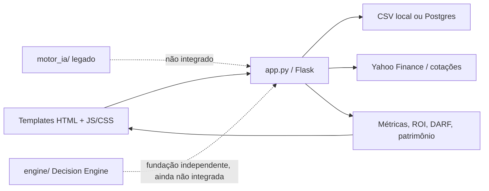

# Arquitetura V4 — FaculdadeMaria / Cortex Invest PRO

## 1. Status do documento

Este documento descreve a arquitetura oficial atual do projeto FaculdadeMaria após a integração da Sprint 1.1-R e da política operacional oficial.

A pasta `docs/` é a única referência oficial de arquitetura e governança do projeto.

Documentos oficiais complementares:

- `DECISION_ENGINE_SPEC.md`;
- `ROADMAP_V5.md`;
- `ESTRATEGIA_OPERACIONAL.md`;
- `PRODUCT_VISION.md`;
- `BACKLOG.md`;
- `REGRAS_DO_PROJETO.md`;
- `CHANGELOG_DESENVOLVIMENTO.md`;
- `SPRINT_01.md`;
- `SPRINT_01_R.md`;
- `SPRINT_01_R_ENCERRAMENTO.md`;
- relatórios técnicos de Sprints posteriores.

Antes de qualquer evolução do Decision Engine, devem ser lidos integralmente, no mínimo:

- este documento;
- `DECISION_ENGINE_SPEC.md`;
- `ESTRATEGIA_OPERACIONAL.md`;
- `PRODUCT_VISION.md`;
- `BACKLOG.md`;
- `REGRAS_DO_PROJETO.md`.

---

## 2. Visão geral

O FaculdadeMaria é atualmente uma aplicação Flask monolítica para gestão de operações com opções, com persistência local por CSV e suporte a PostgreSQL quando `DATABASE_URL` está configurada.

A aplicação existente continua centrada em `app.py`, que concentra rotas, acesso a dados, cálculos financeiros e partes do fluxo de apresentação.

Após a Sprint 1.1-R, o projeto também possui um pacote independente `engine/`, que representa a fundação oficial do novo Decision Engine.

O pacote legado `motor_ia/` permanece preservado, isolado e não deve ser confundido com o novo `engine/`.

Fluxo atual:



---

## 3. Estado arquitetural oficial atual

### 3.1 Aplicação web

O núcleo web continua em `app.py`.

Responsabilidades atuais concentradas no monólito:

- rotas HTTP;
- leitura e gravação de dados;
- cálculos financeiros;
- consultas de cotação;
- exportações;
- backup;
- parte da composição de interface legada.

Rotas principais conhecidas:

- `/`: dashboard;
- `/nova`: cria operação;
- `/editar/<oid>`: edita operação;
- `/fechar/<oid>`: encerra operação;
- `/excluir/<oid>`: remove operação;
- `/reabrir/<oid>`: reabre operação;
- `/operacoes-abertas`: lista operações abertas;
- `/op-fechadas`: lista operações encerradas;
- `/historico`: histórico mensal;
- `/desempenho`: indicadores de desempenho;
- `/carteira`: visão consolidada da carteira;
- `/relatorios`: exportações;
- `/configuracoes`: parâmetros do sistema;
- `/backup`: central de backup;
- `/sobre`: informações do sistema;
- `/cotacao`: consulta cotação via Yahoo.

### 3.2 Persistência

Existem três modos ou vestígios de persistência:

- CSV local em `data/operacoes.csv`, `data/fechadas.csv` e `data/config.csv`;
- SQLite preparado em `data/cortex.db`, com uso reduzido no fluxo principal;
- PostgreSQL/Neon quando existe `DATABASE_URL`.

A arquitetura real permanece:

- CSV local por padrão;
- PostgreSQL em produção quando configurado.

O novo `engine/` não pode acessar diretamente PostgreSQL, SQLite ou CSV.

### 3.3 Regras de negócio existentes

As principais regras de negócio do sistema legado continuam concentradas em `app.py`, especialmente em funções como:

- `enrich_ops`;
- `metrics`;
- `monthly`.

Essa lógica ainda não foi migrada para uma camada de serviços.

A Sprint 1.1-R não alterou esse comportamento.

### 3.4 Interface

A interface usa templates Jinja em `templates/`, com base compartilhada em `templates/base.html`.

Principais templates:

- `templates/dashboard.html`;
- `templates/operacoes_abertas.html`;
- `templates/configuracoes.html`;
- `templates/historico.html`;
- `templates/desempenho.html`;
- `templates/carteira.html`;
- `templates/relatorios.html`;
- `templates/backup.html`;
- `templates/sobre.html`.

Assets principais em `static/`:

- `static/theme.css`;
- `static/dashboard.js`;
- `static/op_abertas.js`;
- `static/search_filters.js`;
- `static/theme.js`;
- `static/favicon.svg`.

Arquivos HTML e CSS antigos na raiz podem representar legado e não devem ser removidos sem validação específica.

---

## 4. Decision Engine oficial

O novo Decision Engine vive em `engine/`.

Ele é o núcleo analítico futuro do FaculdadeMaria e deve permanecer desacoplado de:

- Flask;
- rotas;
- templates;
- PostgreSQL;
- SQLite;
- CSV;
- `yfinance`;
- bibliotecas de rede.

Estrutura atual integrada à `main` após a Sprint 1.1-R:

```text
engine/
|-- __init__.py
|-- errors.py
|-- telemetry.py
|-- version.py
|-- core/
|   |-- __init__.py
|   |-- context.py
|   `-- pipeline.py
`-- providers/
    |-- __init__.py
    `-- base.py
```

### 4.1 Responsabilidades atuais

A fundação implementada oferece:

- hierarquia estruturada de erros;
- telemetria local em memória;
- versão centralizada do motor;
- contexto de execução;
- pipeline pass-through sem regra de negócio;
- contrato abstrato de provider;
- testes de arquitetura e isolamento.

### 4.2 Restrições atuais

O `engine/` ainda não implementa:

- contratos completos de oportunidade;
- snapshot normalizado de mercado;
- indicadores técnicos;
- filtros funcionais;
- qualidade do ativo;
- estratégia PUT funcional;
- score;
- ranking;
- scanner;
- providers reais;
- integração Flask/Radar;
- persistência de decisões;
- explicação financeira final;
- Machine Learning.

Esses itens dependem de Sprints futuras autorizadas e devem respeitar `BACKLOG.md`.

### 4.3 Política operacional obrigatória

Toda evolução do `engine/` deve respeitar `docs/ESTRATEGIA_OPERACIONAL.md`.

Princípios centrais:

- o FaculdadeMaria não é um sistema para especulação;
- o perfil oficial é de venda sistemática de PUT;
- o exercício não é falha automática;
- qualidade do ativo e segurança precedem prêmio;
- preço líquido de aquisição é critério central;
- eficiência do capital é relevante;
- explicabilidade é obrigatória;
- maior prêmio nunca deve ser o principal critério.

### 4.4 Direção de produto

Toda evolução deve respeitar `PRODUCT_VISION.md`.

O primeiro grande resultado visual futuro do Decision Engine é o Radar Premium, mas sua implementação depende das camadas funcionais previstas no backlog.

### 4.5 Backlog oficial

`BACKLOG.md` define:

- itens;
- prioridades;
- dependências;
- caminho crítico;
- sequência recomendada de Sprints.

Registro em backlog não autoriza implementação.

---

## 5. `motor_ia/` legado

Existe um módulo anterior em `motor_ia/`, com arquivos de score, ranking, configuração, cache, explicação e providers.

Arquivos conhecidos:

- `motor_ia/central.py`;
- `motor_ia/score.py`;
- `motor_ia/ranking.py`;
- `motor_ia/configuracao.py`;
- `motor_ia/cache.py`;
- `motor_ia/explicacao.py`;
- `motor_ia/providers/yahoo.py`;
- `motor_ia/providers/brapi.py`.

O módulo permanece legado, não integrado ao fluxo principal e isolado do novo `engine/`.

Inconsistências históricas conhecidas:

- `central.py` chama `calcular_score(op, PESOS)`, enquanto `score.py` define outra assinatura;
- `central.py` importa `ordenar_oportunidades`, enquanto `ranking.py` define `ordenar`;
- providers retornam listas vazias.

Regra oficial:

> Não corrigir, remover, integrar ou refatorar `motor_ia/` sem Sprint específica e autorização explícita.

---

## 6. Deploy

O projeto está preparado para Render via `render.yaml`.

Build:

```text
pip install -r requirements.txt
```

Start:

```text
gunicorn app:app --bind 0.0.0.0:$PORT
```

Dependências principais conhecidas:

- Flask;
- gunicorn;
- psycopg2-binary;
- yfinance.

Essas dependências pertencem à aplicação existente e não autorizam seu uso dentro do novo `engine/`.

---

## 7. Estrutura atual oficial

```text
FaculdadeMaria
|-- app.py
|   |-- rotas HTTP
|   |-- cálculos financeiros legados
|   |-- acesso a CSV/Postgres
|   |-- consultas de cotação
|   `-- exportações/backup
|-- templates/
|   `-- telas Jinja
|-- static/
|   `-- CSS e JavaScript
|-- data/
|   `-- CSVs e persistência local
|-- motor_ia/
|   `-- módulo legado isolado
|-- engine/
|   |-- erros estruturados
|   |-- telemetria local
|   |-- versão centralizada
|   |-- core de orquestração
|   `-- contrato abstrato de providers
|-- tests/
|   `-- testes do Decision Engine e isolamento
`-- docs/
    |-- arquitetura
    |-- especificação
    |-- estratégia operacional
    |-- visão de produto
    |-- backlog
    |-- regras
    |-- changelog
    `-- relatórios de Sprint
```

---

## 8. Diagnóstico

### Pontos fortes

- aplicação Flask simples de executar;
- templates Jinja organizados;
- persistência local simples;
- suporte a PostgreSQL em produção;
- deploy previsto;
- fundação independente do Decision Engine integrada;
- testes arquiteturais do novo motor;
- política operacional formalizada;
- Product Vision oficial;
- backlog priorizado;
- regras permanentes consolidadas;
- changelog de desenvolvimento.

### Pontos de atenção

- `app.py` concentra responsabilidades demais;
- mistura de CSV, SQLite e PostgreSQL;
- parte da UI ainda é gerada em Python;
- arquivos legados permanecem na raiz;
- dashboard possui partes historicamente estáticas;
- `motor_ia/` possui inconsistências e permanece legado;
- o novo `engine/` ainda não está integrado ao Flask;
- o Radar Premium depende de camadas funcionais ainda não implementadas;
- documentação futura deve distinguir sempre `engine/` de `motor_ia/`.

---

## 9. Arquitetura alvo

A evolução recomendada continua gradual, com separação entre:

- `routes`: entrada e saída HTTP;
- `services`: regras de aplicação;
- `repositories`: persistência;
- `models`: contratos de domínio;
- `utils`: funções auxiliares;
- `engine`: análise de oportunidades independente.

Estrutura alvo conceitual:

```text
app.py
cortex/
  __init__.py
  routes/
    dashboard.py
    operacoes.py
    relatorios.py
    configuracoes.py
    backup.py
    radar.py
  services/
    calculos.py
    cotacoes.py
    operacoes_service.py
    metricas.py
    radar_service.py
  repositories/
    csv_repository.py
    postgres_repository.py
  models/
    operacao.py
    config.py
  utils/
    formatadores.py
    datas.py
engine/
  core/
  providers/
  market/
  indicators/
  strategies/
  filters/
  score/
  ranking/
  probability/
  explain/
  learning/
templates/
static/
data/
motor_ia/
```

A integração entre Flask e Decision Engine deverá ocorrer somente por camada de serviço, nunca por importação de regra analítica dentro de rotas.

---

## 10. Caminho crítico até o Radar Premium

A ordem preferencial está detalhada em `BACKLOG.md`.

Resumo arquitetural:

1. contratos completos de oportunidade;
2. métricas operacionais de PUT;
3. normalização de dados;
4. indicadores técnicos puros;
5. qualidade do ativo;
6. filtros de segurança;
7. avaliador de venda de PUT;
8. Score IA explicável;
9. ranking ajustado ao perfil;
10. serviço de Radar;
11. Radar Premium v1.

Nenhuma dessas etapas está autorizada apenas por constar neste documento.

---

## 11. Regras permanentes de evolução

As regras completas estão em `REGRAS_DO_PROJETO.md`.

Resumo obrigatório:

1. Ler integralmente `docs/` antes de implementar.
2. Interromper diante de divergência entre documentação e código.
3. Trabalhar apenas no escopo da Sprint autorizada.
4. Usar branch própria.
5. Nunca alterar `main` diretamente.
6. Preservar funcionalidades existentes.
7. Executar testes e validar regressões.
8. Atualizar documentação necessária.
9. Apresentar relatório técnico.
10. Fazer merge somente após autorização explícita do Product Owner.
11. Nunca iniciar nova Sprint sem autorização.
12. Registrar novas ideias relevantes no backlog.

---

## 12. Conclusão

O FaculdadeMaria permanece funcionalmente baseado no monólito Flask atual, mas possui uma fundação independente e oficial para o novo Decision Engine.

O `engine/` é o caminho arquitetural oficial para a evolução analítica futura.

O `motor_ia/` permanece legado isolado.

Toda evolução do Decision Engine deverá respeitar simultaneamente:

- esta arquitetura;
- `DECISION_ENGINE_SPEC.md`;
- `ROADMAP_V5.md`;
- `ESTRATEGIA_OPERACIONAL.md`;
- `PRODUCT_VISION.md`;
- `BACKLOG.md`;
- `REGRAS_DO_PROJETO.md`;
- decisões autorizadas do Product Owner.

O objetivo é evoluir com segurança, baixo acoplamento, explicabilidade, experiência Premium e preservação integral das funcionalidades existentes.