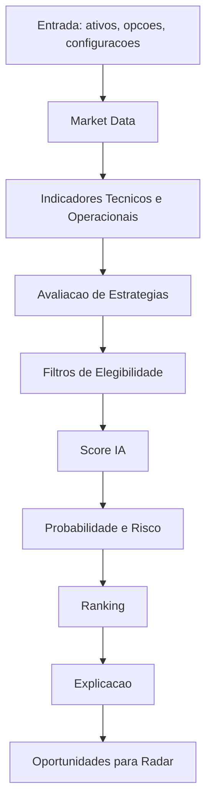

# DECISION_ENGINE_SPEC - FaculdadeMaria / Cortex Invest PRO

## Status do Documento

Este documento e a especificacao tecnica oficial do Decision Engine do projeto FaculdadeMaria / Cortex Invest PRO.

Ele deve orientar todas as implementacoes futuras relacionadas ao Motor de Decisao, Radar de Oportunidades, score de operacoes, ranking, explicacoes em linguagem natural e aprendizado futuro a partir de operacoes encerradas.

Este documento nao define recomendacao financeira automatica. O Decision Engine deve ser tratado como mecanismo de apoio analitico, explicavel e configuravel.

## 1. Objetivo do Decision Engine

### Problema que Resolve

O projeto FaculdadeMaria atualmente gerencia operacoes da estrategia Wheel, calcula indicadores como ROI, premio, capital, DARF e patrimonio, e possui um modulo inicial chamado `motor_ia`. Esse modulo ainda nao esta integrado ao fluxo principal da aplicacao.

O Decision Engine resolve o problema de transformar dados dispersos de mercado, configuracoes do usuario, indicadores tecnicos e regras de estrategia em oportunidades organizadas, ranqueadas e explicadas.

Ele deve responder perguntas como:

- Quais ativos/opcoes merecem atencao agora?
- Uma venda de PUT esta alinhada com os criterios do usuario?
- Uma CALL coberta faz sentido para uma posicao existente?
- A oportunidade tem liquidez suficiente?
- O ROI esperado compensa o risco?
- O strike esta em uma distancia aceitavel?
- A tendencia do ativo favorece ou enfraquece a operacao?
- Por que uma oportunidade recebeu determinado score?

### Papel Dentro da Arquitetura

O Decision Engine sera um modulo de dominio independente, responsavel por analise, classificacao e explicacao de oportunidades.

Ele deve ficar desacoplado do Flask. As rotas da aplicacao nao devem conter regra de score, calculo de indicadores ou logica de ranking. O Flask deve apenas receber a requisicao, chamar um servico de aplicacao e renderizar o resultado.

Na arquitetura alvo, o fluxo esperado e:

```txt
Flask route /radar-oportunidades
  -> cortex.services.radar_service
    -> engine.core.pipeline
      -> providers de mercado
      -> indicadores
      -> estrategias
      -> filtros
      -> score
      -> ranking
      -> explicacao
  -> template Radar
```

### Relacao com Flask

O Flask deve se relacionar com o Decision Engine apenas por uma camada de servico, por exemplo `cortex/services/radar_service.py`.

Responsabilidades do Flask:

- Receber requisicoes HTTP.
- Ler parametros de tela, quando existirem.
- Chamar o servico de radar.
- Renderizar oportunidades, scores, rankings e explicacoes.
- Tratar erros de apresentacao.

Responsabilidades que nao pertencem ao Flask:

- Calcular score.
- Calcular indicadores tecnicos.
- Consultar diretamente provedores de mercado.
- Ordenar oportunidades por regra de negocio.
- Montar explicacoes tecnicas.

### Relacao com PostgreSQL

O Decision Engine nao deve acessar PostgreSQL diretamente.

Quando precisar de dados historicos, configuracoes ou operacoes encerradas, ele deve receber esses dados por interfaces de repositorio ou servicos do dominio principal.

Exemplos de dados que podem vir do PostgreSQL:

- Operacoes abertas.
- Operacoes encerradas.
- Resultado realizado.
- Ativos negociados pelo usuario.
- Configuracoes de risco.
- Pesos personalizados do score.
- Historico de oportunidades analisadas.

O Decision Engine deve depender de contratos de dados, nao de detalhes de banco.

### Relacao com Interfaces

As interfaces web devem apresentar o resultado do Decision Engine, nao implementar sua logica.

Principais telas consumidoras:

- Radar de Oportunidades.
- Dashboard.
- Operacoes Abertas.
- Operacoes Fechadas.
- Desempenho.
- Relatorios.

O Radar sera a interface principal do motor. O Dashboard podera consumir apenas resumos, como quantidade de oportunidades boas, melhor oportunidade do momento ou distribuicao por classe de score.

## 2. Arquitetura do Motor

### Visao Geral

O Decision Engine sera composto por modulos especializados que executam uma pipeline de analise.



### Componentes Internos

#### Core

Coordena a execucao da pipeline. Nao deve conter calculo especifico de indicador ou estrategia. Sua responsabilidade e orquestrar os passos.

#### Market

Normaliza dados de mercado vindos de provedores externos. Deve transformar respostas diferentes em uma estrutura interna unica.

#### Providers

Implementa integracoes com fontes de dados, como Yahoo Finance, Brapi ou outros provedores futuros.

#### Indicators

Calcula ou prepara indicadores usados pelo motor. Nesta especificacao os calculos nao sao implementados; apenas se define a finalidade e o papel de cada indicador.

#### Strategies

Avalia oportunidades de acordo com estrategias suportadas: Venda de PUT, CALL Coberta e Wheel.

#### Filters

Remove oportunidades que nao atendem criterios minimos, como liquidez insuficiente, vencimento inadequado, ROI muito baixo ou falta de dados.

#### Score

Combina indicadores, estrategia e filtros em uma nota final configuravel.

#### Ranking

Ordena oportunidades por prioridade operacional.

#### Probability

Prepara a evolucao futura para estimativas de probabilidade e risco. Inicialmente pode apenas estruturar campos e contratos sem aplicar Machine Learning.

#### Explain

Gera justificativas em linguagem natural para cada score.

#### Learning

Prepara a arquitetura para aprendizado futuro com base em operacoes encerradas. Nao deve implementar Machine Learning nesta fase.

#### Config

Centraliza pesos, limites, thresholds, provedores habilitados e parametros de estrategia.

## 3. Pipeline de Decisao

### Fluxo Completo

```txt
Mercado
↓
Indicadores
↓
Estrategias
↓
Filtros
↓
Score
↓
Probabilidade
↓
Ranking
↓
Explicacao
↓
Radar
```

### Etapas

#### 1. Mercado

Entrada de dados brutos:

- Ativo base.
- Codigo da opcao.
- Preco atual.
- Strike.
- Premio.
- Vencimento.
- Volume.
- Liquidez.
- Dados historicos de preco.
- Volatilidade, quando disponivel.

Saida esperada:

- Estrutura normalizada de mercado.
- Sinalizacao de dados ausentes.
- Fonte dos dados.
- Timestamp da coleta.

#### 2. Indicadores

Transforma dados de mercado em sinais tecnicos e operacionais.

Exemplos:

- Tendencia pela MM21 e MM200.
- Forca relativa pelo IFR14.
- Regiao de preco pelas Bandas de Bollinger.
- Risco de oscilacao pelo ATR.
- Qualidade operacional por liquidez e volume.
- Atratividade da opcao por ROI, dias e distancia do strike.

#### 3. Estrategias

Avalia a oportunidade sob uma estrategia especifica:

- Venda de PUT.
- CALL Coberta.
- Wheel.

A mesma opcao pode ter uma nota diferente dependendo da estrategia.

#### 4. Filtros

Aplica criterios minimos.

Exemplos:

- Ignorar opcoes sem liquidez.
- Ignorar vencimentos muito curtos ou muito longos, se fora da configuracao.
- Ignorar ROI abaixo do minimo.
- Ignorar ativos sem cotacao confiavel.
- Ignorar strikes incompatíveis com a estrategia.

Filtros devem indicar o motivo da exclusao. Uma oportunidade descartada pode aparecer como "nao elegivel" em modo diagnostico.

#### 5. Score

Combina os sinais em uma nota de 0 a 100.

O score deve ser:

- Configuravel.
- Explicavel.
- Testavel.
- Reproduzivel.
- Separado por estrategia.

#### 6. Probabilidade

Camada reservada para evolucao futura.

Na primeira implementacao, pode apenas organizar campos como:

- Probabilidade estimada de manter fora do dinheiro.
- Risco de exercicio.
- Risco de volatilidade.
- Confianca da analise.

Nao deve haver Machine Learning nesta fase.

#### 7. Ranking

Ordena as oportunidades que passaram pelos filtros.

O ranking deve considerar score final e criterios de desempate.

#### 8. Explicacao

Gera uma justificativa curta e clara para o usuario.

A explicacao deve dizer por que a oportunidade recebeu aquele score, quais fatores ajudaram, quais prejudicaram e quais riscos merecem atencao.

#### 9. Radar

Entrega final para interface:

- Lista de oportunidades.
- Score.
- Classe.
- Ranking.
- Indicadores relevantes.
- Explicacao.
- Alertas.
- Fonte e horario dos dados.

## 4. Estrutura de Modulos

Estrutura alvo do Decision Engine:

```txt
engine/
  __init__.py
  config.py
  core/
    __init__.py
    pipeline.py
    context.py
    contracts.py
  market/
    __init__.py
    normalizer.py
    snapshot.py
  providers/
    __init__.py
    base.py
    yahoo.py
    brapi.py
  indicators/
    __init__.py
    trend.py
    momentum.py
    volatility.py
    liquidity.py
    options.py
  strategies/
    __init__.py
    put_selling.py
    covered_call.py
    wheel.py
  score/
    __init__.py
    calculator.py
    weights.py
    classes.py
  ranking/
    __init__.py
    sorter.py
    tie_breakers.py
  probability/
    __init__.py
    estimator.py
    risk.py
  explain/
    __init__.py
    explainer.py
    templates.py
  learning/
    __init__.py
    history.py
    feedback.py
    dataset.py
```

### `engine/`

Pacote principal do Decision Engine. Deve ser importavel por servicos Flask, scripts, testes e tarefas futuras.

### `engine/config.py`

Centraliza configuracoes do motor:

- Pesos padrao.
- Limites minimos.
- Parametros de elegibilidade.
- Classes de score.
- Provedores habilitados.
- Timeouts e politicas de fallback.

Essas configuracoes devem poder ser sobrescritas por configuracoes do usuario no futuro.

### `engine/core/`

Contem a orquestracao da pipeline.

Responsabilidades:

- Definir contratos de entrada e saida.
- Criar contexto de execucao.
- Encadear mercado, indicadores, estrategias, filtros, score, ranking e explicacao.
- Garantir que falhas parciais sejam tratadas.

Nao deve conter detalhes de provedores ou formulas especificas.

### `engine/market/`

Responsavel por representar e normalizar dados de mercado.

Responsabilidades:

- Converter dados brutos para formato interno.
- Validar presenca de campos obrigatorios.
- Identificar fonte dos dados.
- Marcar dados incompletos ou inconsistentes.

### `engine/providers/`

Responsavel por integracoes externas.

Responsabilidades:

- Buscar cotacoes.
- Buscar historico de precos.
- Buscar dados de opcoes, quando disponivel.
- Encapsular detalhes de cada API.
- Retornar dados em formato bruto para o modulo `market`.

Provedores iniciais previstos:

- Yahoo.
- Brapi.

O motor deve estar preparado para multiplos provedores e fallback entre eles.

### `engine/indicators/`

Responsavel por preparar sinais tecnicos e operacionais.

Responsabilidades:

- Organizar indicadores de tendencia.
- Organizar indicadores de momentum.
- Organizar indicadores de volatilidade.
- Organizar indicadores de liquidez.
- Organizar indicadores especificos de opcoes.

Este modulo nao deve decidir se uma oportunidade e boa sozinho. Ele apenas gera insumos.

### `engine/strategies/`

Responsavel por avaliar oportunidades dentro de uma estrategia.

Responsabilidades:

- Aplicar regras de Venda de PUT.
- Aplicar regras de CALL Coberta.
- Aplicar regras da Wheel.
- Definir elegibilidade por estrategia.
- Produzir sinais especificos da estrategia.

### `engine/score/`

Responsavel por transformar sinais em nota.

Responsabilidades:

- Aplicar pesos.
- Normalizar sinais.
- Gerar score final de 0 a 100.
- Classificar score em faixas.
- Permitir configuracao de pesos por usuario ou por perfil.

### `engine/ranking/`

Responsavel por ordenar oportunidades.

Responsabilidades:

- Ordenar por score final.
- Aplicar criterios de desempate.
- Separar oportunidades elegiveis e nao elegiveis.
- Preparar top oportunidades para o Radar.

### `engine/probability/`

Modulo reservado para estimativas futuras de probabilidade e risco.

Responsabilidades futuras:

- Estimar chance de a opcao vencer fora do dinheiro.
- Estimar risco de exercicio.
- Avaliar confianca da analise.
- Incorporar historico de acertos e erros.

Na fase inicial, deve apenas manter contratos e campos preparados.

### `engine/explain/`

Responsavel por linguagem natural.

Responsabilidades:

- Traduzir score em justificativa.
- Destacar fatores positivos.
- Destacar fatores negativos.
- Explicar filtros.
- Informar riscos.
- Gerar texto claro para usuario nao tecnico.

### `engine/learning/`

Modulo preparado para aprendizado futuro.

Responsabilidades futuras:

- Receber operacoes encerradas.
- Comparar expectativa do score com resultado real.
- Montar dataset historico.
- Gerar estatisticas de acerto por criterio.
- Apoiar ajuste de pesos.

Nao deve implementar Machine Learning ate que haja base historica suficiente e criterios validados.

## 5. Indicadores Utilizados

Esta secao descreve a finalidade dos indicadores. Nao define nem implementa formulas.

### MM21

Media movel de 21 periodos.

Finalidade:

- Capturar tendencia de curto prazo.
- Indicar se o ativo esta em movimento recente de alta, baixa ou lateralidade.
- Apoiar avaliacao de timing para operacoes de opcoes.

Uso esperado:

- Em Venda de PUT, tendencia de curto prazo positiva ou estavel tende a favorecer.
- Em CALL Coberta, tendencia muito forte de alta pode exigir cuidado, pois aumenta risco de exercicio.
- Na Wheel, ajuda a entender o momento do ativo dentro do ciclo.

### MM200

Media movel de 200 periodos.

Finalidade:

- Capturar tendencia estrutural de longo prazo.
- Diferenciar ativos em tendencia principal de alta, baixa ou consolidacao.
- Ajudar a evitar operacoes contra um movimento estrutural relevante.

Uso esperado:

- Ativo acima da MM200 pode indicar contexto estrutural mais saudavel.
- Ativo abaixo da MM200 pode exigir score menor ou alerta de risco.
- Cruzamentos e distancia em relacao a MM200 podem ser usados como sinais de tendencia.

### IFR14 (RSI)

Indice de Forca Relativa de 14 periodos.

Finalidade:

- Medir momentum.
- Identificar regioes de sobrecompra ou sobrevenda.
- Apoiar avaliacao de entrada em ativos esticados.

Uso esperado:

- IFR muito baixo pode indicar sobrevenda, mas tambem risco de queda persistente.
- IFR muito alto pode indicar sobrecompra e risco de correcao.
- Valores intermediarios podem ser considerados mais neutros.

### Bandas de Bollinger

Indicador de faixa de preco baseado em media e desvio.

Finalidade:

- Avaliar se o preco esta em regiao extrema da sua variacao recente.
- Observar compressao ou expansao de volatilidade.
- Apoiar leitura de risco de reversao ou continuidade.

Uso esperado:

- Preco proximo da banda inferior pode indicar ativo pressionado ou oportunidade de reversao.
- Preco proximo da banda superior pode indicar ativo esticado.
- Bandas muito abertas sinalizam volatilidade maior.

### ATR

Average True Range.

Finalidade:

- Medir amplitude media de movimento do ativo.
- Representar risco de oscilacao.
- Apoiar avaliacao de distancia segura do strike.

Uso esperado:

- ATR alto sugere maior risco de o preco atingir o strike.
- ATR baixo sugere ativo menos volátil, mas pode reduzir premios.
- Distancia do strike pode ser comparada com a amplitude esperada.

### Volatilidade Implicita

Volatilidade embutida no preco das opcoes.

Finalidade:

- Indicar expectativa de oscilacao futura.
- Explicar premios altos ou baixos.
- Ajudar a avaliar se o premio compensa o risco.

Uso esperado:

- Volatilidade implicita alta pode melhorar premio, mas aumenta risco.
- Volatilidade baixa pode reduzir ROI esperado.
- Deve ser analisada em conjunto com ATR, dias para vencimento e distancia do strike.

### Liquidez

Capacidade de entrar e sair de uma operacao com impacto aceitavel.

Finalidade:

- Evitar oportunidades teoricamente boas, mas dificilmente executaveis.
- Reduzir risco de spread alto.
- Melhorar confiabilidade do score.

Uso esperado:

- Liquidez insuficiente deve reduzir muito o score ou tornar a oportunidade inelegivel.
- O motor deve distinguir falta de liquidez de falta de dados.

### Volume

Quantidade negociada do ativo ou da opcao.

Finalidade:

- Confirmar interesse de mercado.
- Apoiar leitura de confiabilidade do preco.
- Complementar a analise de liquidez.

Uso esperado:

- Volume alto favorece execucao e confiabilidade.
- Volume baixo exige alerta.
- Volume anormalmente alto pode indicar evento ou risco.

### Distancia do Strike

Distancia entre o preco atual do ativo e o strike da opcao.

Finalidade:

- Avaliar margem de seguranca.
- Medir risco de exercicio.
- Comparar premio recebido com distancia ate o ponto critico.

Uso esperado:

- Em Venda de PUT, strike abaixo do preco atual tende a oferecer margem de seguranca.
- Em CALL Coberta, strike acima do preco atual define potencial de ganho e risco de chamada.
- Distancia deve ser interpretada junto com ATR, volatilidade e dias para vencimento.

### Dias para Vencimento

Tempo restante ate o vencimento da opcao.

Finalidade:

- Avaliar exposicao temporal.
- Relacionar premio com prazo.
- Apoiar decisao sobre eficiencia do ROI.

Uso esperado:

- Vencimentos muito curtos podem ter risco operacional maior.
- Vencimentos muito longos podem travar capital por tempo demais.
- A faixa ideal deve ser configuravel.

### ROI Esperado

Retorno estimado da operacao em relacao ao capital comprometido.

Finalidade:

- Medir atratividade financeira da oportunidade.
- Comparar oportunidades de strikes, ativos e vencimentos diferentes.
- Apoiar ranking.

Uso esperado:

- ROI abaixo do minimo configurado reduz score ou elimina a oportunidade.
- ROI alto demais deve ser analisado com cuidado, pois pode refletir risco elevado.
- ROI deve ser combinado com liquidez, volatilidade e distancia do strike.

## 6. Estrategias Suportadas

### Venda de PUT

Estrategia em que o usuario vende uma opcao PUT e recebe premio, assumindo a possibilidade de comprar o ativo pelo strike se for exercido.

Deve ser utilizada quando:

- O usuario aceita comprar o ativo no strike analisado.
- O ativo tem qualidade minima segundo criterios configurados.
- O strike oferece margem de seguranca adequada.
- O premio gera ROI esperado compativel.
- A liquidez e suficiente.
- O vencimento esta dentro da faixa desejada.

Sinais favoraveis:

- Ativo em tendencia positiva ou estavel.
- Strike abaixo do preco atual.
- Boa distancia do strike em relacao ao ATR.
- Premio atrativo sem volatilidade excessiva.
- Volume e liquidez adequados.

Alertas:

- Ativo abaixo da MM200.
- Queda forte recente.
- IFR indicando pressao relevante.
- Baixa liquidez.
- ROI alto causado por risco extremo.

### CALL Coberta

Estrategia em que o usuario possui o ativo e vende uma opcao CALL, recebendo premio e aceitando a possibilidade de vender o ativo no strike.

Deve ser utilizada quando:

- O usuario ja possui o ativo ou esta em fase da Wheel com ativo em carteira.
- O strike representa um preco aceitavel de venda.
- O premio compensa a obrigacao assumida.
- A tendencia nao indique risco desproporcional de chamada indesejada.

Sinais favoraveis:

- Ativo lateral ou com alta moderada.
- Strike acima do preco atual.
- Premio adequado para o prazo.
- Liquidez suficiente.
- Contexto tecnico sem excesso de sobrecompra.

Alertas:

- Tendencia de alta muito forte.
- Preco muito proximo do strike.
- IFR muito alto.
- Volatilidade elevada.
- Risco de perder upside relevante.

### Estrategia Wheel

Estrategia composta por ciclos de venda de PUT, eventual compra do ativo por exercicio e posterior venda de CALL coberta.

Deve ser utilizada quando:

- O usuario aceita acumular ou vender ativos dentro de um processo disciplinado.
- O ativo e considerado adequado para a carteira.
- O objetivo e gerar premios recorrentes.
- Ha controle de capital, risco e vencimentos.

Sinais favoraveis:

- Ativos liquidos e conhecidos.
- Premios consistentes.
- Boa relacao entre ROI e risco.
- Historico de operacoes bem-sucedidas no ativo.
- Capacidade de manter o ativo em carteira, se exercido.

Alertas:

- Concentracao excessiva em um unico ativo.
- Capital insuficiente.
- Ativo com tendencia estrutural deteriorada.
- Liquidez ruim.
- Excesso de operacoes simultaneas no mesmo vencimento.

## 7. Sistema de Score

### Composicao do Score IA

O Score IA deve representar uma avaliacao sintetica da oportunidade em uma escala de 0 a 100.

Ele deve combinar:

- Tendencia.
- Momentum.
- Volatilidade.
- Liquidez.
- Volume.
- Distancia do strike.
- Dias para vencimento.
- ROI esperado.
- Adequacao da estrategia.
- Risco operacional.
- Confianca dos dados.

O score nao deve ser uma recomendacao absoluta. Ele e um mecanismo de priorizacao e explicacao.

### Classes Iniciais

| Faixa | Classe | Interpretacao |
|---:|---|---|
| 90 a 100 | Excelente | Oportunidade muito forte dentro dos criterios atuais |
| 80 a 89 | Muito Boa | Oportunidade atrativa com poucos alertas |
| 70 a 79 | Boa | Oportunidade valida, mas exige revisao dos pontos fracos |
| 60 a 69 | Regular | Pode ser considerada, mas nao deve ser prioridade |
| 0 a 59 | Atencao | Risco, dados fracos ou baixa aderencia aos criterios |

### Pesos Iniciais

| Fator | Peso Inicial |
|---|---:|
| Tendencia MM21/MM200 | 15 |
| Momentum IFR14 | 8 |
| Bandas de Bollinger | 7 |
| ATR / risco de oscilacao | 8 |
| Volatilidade implicita | 10 |
| Liquidez | 12 |
| Volume | 8 |
| Distancia do strike | 12 |
| Dias para vencimento | 8 |
| ROI esperado | 12 |
| Total | 100 |

### Configurabilidade

Todos os pesos devem ser configuraveis.

No inicio, os pesos podem viver em `engine/config.py`. Em fases posteriores, poderao ser armazenados no banco e editados pela tela de configuracoes.

Configuracoes esperadas:

- Peso por indicador.
- ROI minimo.
- Liquidez minima.
- Volume minimo.
- Faixa ideal de dias para vencimento.
- Distancia minima do strike.
- Perfil de risco.
- Estrategias habilitadas.
- Provedores de dados habilitados.

### Regras do Score

- O score final deve ser reproduzivel para a mesma entrada.
- Cada componente do score deve poder ser auditado.
- O sistema deve guardar os fatores que contribuiram para a nota.
- Dados ausentes devem reduzir confianca ou gerar alerta.
- O score deve permitir explicacao em linguagem natural.

## 8. Ranking

O ranking define a ordem em que oportunidades aparecem no Radar.

### Ordenacao Principal

Oportunidades elegiveis devem ser ordenadas por:

1. Score final decrescente.
2. Classe de score.
3. Liquidez.
4. ROI esperado.
5. Distancia do strike.
6. Dias para vencimento mais proximos da faixa ideal.
7. Confianca dos dados.

### Separacao por Status

O ranking deve separar oportunidades em grupos:

- Elegiveis.
- Em observacao.
- Nao elegiveis.
- Dados insuficientes.

O Radar principal deve priorizar elegiveis e em observacao. Itens nao elegiveis podem aparecer em modo diagnostico.

### Criterios de Desempate

Quando duas oportunidades tiverem score semelhante, desempatar por:

- Maior liquidez.
- Melhor confianca dos dados.
- Menor risco de oscilacao relativo.
- Melhor adequacao ao perfil do usuario.
- Maior diversificacao em relacao a operacoes abertas.

## 9. Explicacao em Linguagem Natural

Cada oportunidade deve ser acompanhada de uma explicacao clara.

### Objetivo da Explicacao

A explicacao deve permitir que o usuario entenda:

- Por que a oportunidade recebeu aquele score.
- Quais fatores foram positivos.
- Quais fatores foram negativos.
- Quais dados estao ausentes.
- Qual e o principal risco.
- Qual estrategia esta sendo avaliada.

### Estrutura Recomendada

Cada explicacao deve conter:

- Resumo curto.
- Pontos favoraveis.
- Pontos de atencao.
- Indicadores que mais influenciaram o score.
- Conclusao operacional.

Exemplo conceitual:

```txt
Esta oportunidade recebeu score 82, classe Muito Boa.
O ROI esperado esta acima do minimo configurado, a liquidez e adequada e o strike esta a uma distancia confortavel do preco atual.
O principal ponto de atencao e a volatilidade elevada, que aumenta o risco de o ativo se aproximar do strike antes do vencimento.
```

### Regras de Linguagem

- Ser objetiva.
- Evitar jargao excessivo.
- Nao afirmar certeza.
- Nao prometer lucro.
- Diferenciar oportunidade de recomendacao.
- Explicar alertas de forma acionavel.

## 10. Aprendizado Futuro

O Decision Engine deve ser preparado para aprender com operacoes encerradas, mas sem implementar Machine Learning nas primeiras fases.

### Dados Necessarios

Para permitir aprendizado futuro, cada oportunidade analisada e cada operacao encerrada devem poder registrar:

- Ativo.
- Opcao.
- Estrategia.
- Data da analise.
- Data de abertura.
- Data de fechamento.
- Score original.
- Classe original.
- Indicadores no momento da decisao.
- Premio esperado.
- ROI esperado.
- Resultado realizado.
- Motivo de fechamento.
- Se houve exercicio.
- Se a operacao foi vencedora.

### Arquitetura Necessaria

O modulo `engine/learning/` deve preparar:

- Historico de decisoes.
- Historico de resultados.
- Comparacao entre score previsto e resultado real.
- Dataset para analise futura.
- Metricas por ativo, estrategia, vencimento e faixa de score.

### Evolucoes Futuras Possiveis

Sem implementar agora, a arquitetura deve permitir:

- Ajuste automatico ou semi-automatico de pesos.
- Analise de quais indicadores mais acertaram.
- Identificacao de ativos com melhor desempenho historico.
- Calibragem de risco por perfil do usuario.
- Estimativa de probabilidade baseada em historico.

### Restricoes

- Nao implementar Machine Learning sem base historica suficiente.
- Nao alterar pesos automaticamente sem auditoria.
- Nao ocultar do usuario por que uma nota mudou.
- Nao transformar o motor em caixa-preta.

## 11. Roadmap Tecnico do Decision Engine

### v4.4 - Contratos, Configuracao e Fundacao

Entregas:

- Definir pacote `engine/`.
- Definir contratos de entrada e saida.
- Definir configuracao inicial de pesos.
- Definir classes de score.
- Criar interfaces de providers.
- Preparar normalizacao de dados de mercado.
- Garantir que o motor seja desacoplado do Flask.

Criterios de conclusao:

- O motor pode ser importado sem iniciar Flask.
- Existe contrato claro para oportunidade analisada.
- Pesos iniciais estao centralizados.
- Providers podem ser substituidos por mocks em testes.

### v4.5 - Indicadores e Servico de Radar

Entregas:

- Estruturar modulos de indicadores.
- Preparar indicadores tecnicos e operacionais.
- Criar `cortex/services/radar_service.py`.
- Integrar servico de radar com configuracoes do sistema.
- Criar primeira saida estruturada de oportunidades.

Criterios de conclusao:

- O servico de radar consegue chamar o motor.
- Indicadores retornam sinais normalizados.
- Dados ausentes sao tratados sem quebrar a pagina.
- Ainda nao e necessario ranking sofisticado.

### v4.6 - Estrategias, Filtros e Score Inicial

Entregas:

- Implementar avaliacao conceitual por estrategia.
- Suportar Venda de PUT.
- Suportar CALL Coberta.
- Suportar Wheel.
- Aplicar filtros minimos.
- Gerar score de 0 a 100.
- Classificar oportunidades por faixa.

Criterios de conclusao:

- Cada oportunidade tem estrategia, score e classe.
- Filtros explicam por que uma oportunidade foi descartada.
- Pesos sao configuraveis em arquivo.
- Testes cobrem score basico e filtros.

### v4.7 - Ranking, Explicacao e Radar Visual

Entregas:

- Ordenar oportunidades por score.
- Aplicar criterios de desempate.
- Gerar explicacao em linguagem natural.
- Integrar resultados a `/radar-oportunidades`.
- Exibir score, classe, motivos e alertas.
- Separar elegiveis, observacao e nao elegiveis.

Criterios de conclusao:

- Radar exibe oportunidades ordenadas.
- Cada oportunidade possui explicacao clara.
- Falhas de provider geram alerta amigavel.
- O Flask nao contem regra do motor.

### v5.0 - Motor Estavel, Auditavel e Preparado para Aprendizado

Entregas:

- Decision Engine modular e documentado.
- Testes para pipeline, score, ranking e explicacao.
- Configuracao de pesos validada.
- Registro historico de decisoes preparado.
- Integracao com operacoes encerradas planejada ou iniciada.
- Documentacao de uso interno.
- Fallback para multiplos provedores.

Criterios de conclusao:

- Motor pode ser usado por Radar, Dashboard e Relatorios.
- Oportunidades sao reproduziveis e auditaveis.
- Explicacoes sao consistentes com o score.
- Estrutura de aprendizado futuro esta preparada.
- Nenhuma dependencia direta com Flask ou PostgreSQL existe dentro do pacote `engine/`.

## 12. Principios

Todo codigo do Decision Engine deve seguir estes principios:

### Desacoplado do Flask

O motor nao deve importar `flask`, `request`, `render_template`, `url_for` ou objetos de rota.

### Desacoplado do Banco

O motor nao deve abrir conexao direta com PostgreSQL, SQLite ou CSV. Dados devem chegar por contratos.

### Testavel

Cada parte deve permitir teste unitario com dados controlados.

### Modular

Indicadores, estrategias, score, ranking e explicacao devem ser modulos separados.

### Reutilizavel

O motor deve poder ser usado por rotas, scripts, testes, jobs futuros e relatorios.

### Configuravel

Pesos, limites, provedores e estrategias devem ser configuraveis sem reescrever o motor.

### Explicavel

Todo score deve poder ser justificado. Nenhuma oportunidade deve receber nota sem fatores rastreaveis.

### Preparado para Multiplos Provedores

O motor deve suportar Yahoo, Brapi e provedores futuros por interfaces intercambiaveis.

### Preparado para Falhas Externas

Falhas de mercado, timeouts e dados ausentes devem gerar alertas, nao derrubar a aplicacao.

### Sem Recomendacao Absoluta

O motor deve apoiar decisao, nao prometer resultado ou automatizar recomendacao financeira sem contexto.

### Reproduzivel

A mesma entrada com a mesma configuracao deve gerar o mesmo score.

### Auditavel

O sistema deve guardar ou expor os fatores que compuseram o score.

### Evolutivo

A arquitetura deve permitir aprendizado futuro sem reescrever tudo.

### Conservador com Dados Incompletos

Dados ausentes devem reduzir confianca, gerar alerta ou impedir elegibilidade.

### Compatibilidade com o Projeto Atual

O motor deve evoluir respeitando a arquitetura planejada do FaculdadeMaria, sem quebrar dashboard, operacoes abertas, operacoes fechadas, historico, configuracoes, backup ou exportacoes.

## Contrato Conceitual de Saida

Toda oportunidade analisada deve poder ser representada conceitualmente com os campos abaixo:

```txt
id
ativo
opcao
estrategia
preco_atual
strike
premio
vencimento
dias_para_vencimento
roi_esperado
indicadores
filtros
score
classe
ranking
explicacao
alertas
fonte_dados
timestamp
confianca
```

Este contrato pode evoluir, mas qualquer mudanca deve preservar compatibilidade com o Radar e com testes existentes.

## Conclusao

O Decision Engine sera o nucleo analitico do FaculdadeMaria / Cortex Invest PRO. Sua funcao e transformar dados de mercado e regras de estrategia em oportunidades priorizadas, explicaveis e preparadas para evolucao.

A implementacao deve ser incremental:

1. Primeiro contratos e arquitetura.
2. Depois indicadores e filtros.
3. Depois score e ranking.
4. Depois explicacao.
5. Por fim, aprendizado futuro.

O sucesso do motor nao sera medido apenas por gerar uma nota, mas por produzir analises confiaveis, compreensiveis, auditaveis e uteis para o usuario tomar decisoes melhores dentro da estrategia Wheel.
