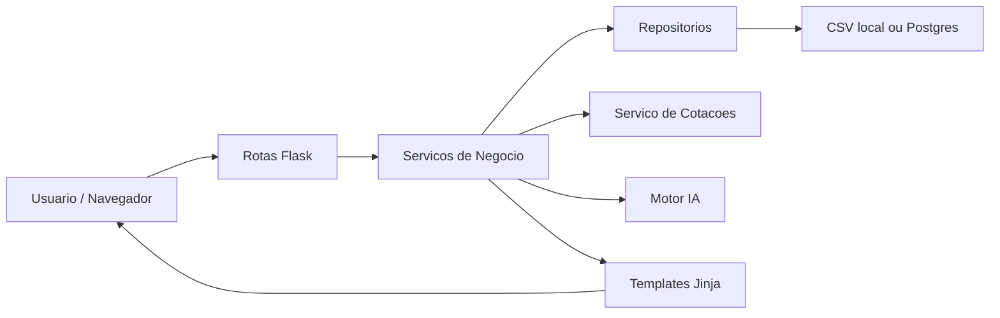

# ROADMAP V5 - FaculdadeMaria / Cortex Invest PRO

## Objetivo

Evoluir o projeto FaculdadeMaria ate a versao 5.0 com uma arquitetura mais clara, segura e preparada para crescimento, preservando as funcionalidades existentes durante toda a migracao.

Este roadmap define a arquitetura alvo, a ordem correta de implementacao, os riscos por etapa, a estrategia de protecao contra regressao e os criterios de conclusao das versoes v4.4, v4.5, v4.6, v4.7 e v5.0.

## 1. Arquitetura Alvo do Sistema

### Visao Geral

A arquitetura alvo e uma aplicacao Flask modular, organizada por dominio, com separacao entre rotas, servicos, persistencia, modelos, utilitarios e interface.

O sistema deve continuar simples de executar, mas com responsabilidades bem definidas:

- Rotas Flask cuidam de entrada HTTP e resposta.
- Servicos concentram regras de negocio.
- Repositorios concentram acesso a dados.
- Modelos definem estruturas de dados.
- Templates e arquivos estaticos cuidam da interface.
- Motor IA fica isolado como modulo de analise e ranking.

### Estrutura Alvo

```txt
app.py
cortex/
  __init__.py
  config.py
  routes/
    __init__.py
    dashboard.py
    operacoes.py
    historico.py
    desempenho.py
    carteira.py
    relatorios.py
    configuracoes.py
    backup.py
    radar.py
  services/
    __init__.py
    metricas_service.py
    operacoes_service.py
    cotacoes_service.py
    configuracoes_service.py
    exportacoes_service.py
    radar_service.py
  repositories/
    __init__.py
    base_repository.py
    csv_repository.py
    postgres_repository.py
  models/
    __init__.py
    operacao.py
    configuracao.py
  utils/
    __init__.py
    datas.py
    formatadores.py
    validadores.py
templates/
static/
data/
motor_ia/
tests/
```

### Fluxo Alvo



### Principios da Arquitetura

- O comportamento atual deve ser preservado antes de qualquer melhoria visual ou funcional.
- Nenhuma rota deve acessar CSV ou Postgres diretamente depois da migracao para repositorios.
- Nenhum template deve conter regra financeira complexa.
- Calculos de ROI, DARF, lucro, patrimonio e premios devem ficar em servicos.
- O sistema deve funcionar localmente mesmo sem Postgres.
- O Postgres deve ser usado em producao quando `DATABASE_URL` estiver configurado.
- O Motor IA deve ser integrado somente depois que dados e metricas estiverem estaveis.

## 2. Etapas da Migracao

### Etapa 1 - Estabilizacao da Base Atual

Objetivo: garantir que o sistema atual seja compreendido, documentado e verificavel antes da reorganizacao.

Atividades:

- Mapear rotas existentes.
- Identificar templates usados e arquivos legados.
- Confirmar campos reais de `operacoes.csv`, `fechadas.csv` e `config.csv`.
- Criar uma lista de funcionalidades que nao podem quebrar.
- Definir dados de exemplo para teste manual.
- Levantar inconsistencias entre CSV, SQLite e Postgres.

Riscos:

- Haver comportamento importante escondido em HTML string dentro de `app.py`.
- Algumas telas podem depender de campos calculados implicitamente.
- O sistema pode ter arquivos antigos que parecem ativos, mas nao sao usados.

Mitigacao:

- Registrar o comportamento atual antes de mover qualquer codigo.
- Migrar uma rota por vez.
- Comparar resultados antes e depois da alteracao.

### Etapa 2 - Criacao da Camada de Utilitarios

Objetivo: extrair funcoes puras e reutilizaveis sem alterar comportamento.

Atividades:

- Mover formatacao monetaria para `utils/formatadores.py`.
- Mover conversao numerica para `utils/formatadores.py`.
- Mover funcoes de data para `utils/datas.py`.
- Criar testes simples para conversao de numeros, datas e formatacao.

Riscos:

- Pequenas diferencas de formatacao podem afetar templates.
- Conversao de numeros brasileiros pode alterar calculos existentes.

Mitigacao:

- Copiar comportamento atual antes de melhorar.
- Criar testes com valores reais dos CSVs.
- Evitar refatoracao estetica nesta etapa.

### Etapa 3 - Criacao da Camada de Repositorios

Objetivo: padronizar acesso aos dados sem que as rotas saibam se a origem e CSV ou Postgres.

Atividades:

- Criar interface de repositorio.
- Implementar `csv_repository.py`.
- Implementar `postgres_repository.py`.
- Padronizar metodos:
  - listar operacoes.
  - buscar operacao.
  - criar operacao.
  - atualizar operacao.
  - excluir operacao.
  - fechar operacao.
  - reabrir operacao.
  - carregar configuracoes.
  - salvar configuracoes.

Riscos:

- O Postgres pode nao ter as mesmas colunas do CSV.
- Algumas rotas hoje ainda leem CSV diretamente mesmo com Postgres ativo.
- Fechamento de operacao pode usar campos ainda inexistentes no banco.

Mitigacao:

- Definir schema minimo oficial.
- Manter fallback CSV.
- Fazer migracao de uso por rota, nao de uma vez.
- Criar backup antes de qualquer mudanca futura de dados.

### Etapa 4 - Criacao da Camada de Servicos

Objetivo: mover regras de negocio para servicos testaveis.

Atividades:

- Criar `metricas_service.py`.
- Criar `operacoes_service.py`.
- Criar `cotacoes_service.py`.
- Criar `configuracoes_service.py`.
- Mover calculos de capital, premio liquido, ROI, DARF, patrimonio e historico mensal.
- Criar testes para os principais calculos financeiros.

Riscos:

- Mudanca em calculo financeiro pode alterar numeros exibidos.
- Alguns templates podem depender de nomes de campos atuais.

Mitigacao:

- Preservar nomes de campos retornados para templates.
- Criar testes comparando resultados antigos e novos.
- Validar dashboard, abertas, fechadas, historico e desempenho apos cada migracao.

### Etapa 5 - Modularizacao das Rotas

Objetivo: reduzir o tamanho de `app.py` e separar paginas por dominio.

Atividades:

- Criar blueprints por area.
- Migrar rotas de dashboard.
- Migrar rotas de operacoes.
- Migrar rotas de historico/desempenho/carteira.
- Migrar rotas de relatorios/exportacoes.
- Migrar rotas de configuracoes e backup.
- Manter URLs atuais.

Riscos:

- Quebra de `url_for`.
- Erro em nomes de endpoints.
- Duplicidade de rotas durante transicao.

Mitigacao:

- Manter as mesmas URLs publicas.
- Migrar uma area por vez.
- Testar navegacao pelo menu apos cada grupo de rotas.

### Etapa 6 - Padronizacao da Interface

Objetivo: transformar telas em templates consistentes, removendo HTML gerado dentro de Python.

Atividades:

- Garantir que todas as paginas usem `base.html`.
- Criar template proprio para operacoes fechadas.
- Remover HTML string de rotas.
- Padronizar cards, tabelas, formularios e botoes.
- Reduzir estilos inline.
- Consolidar CSS em `static/theme.css`.

Riscos:

- Mudanca visual pode ocultar informacoes importantes.
- Tabelas podem perder colunas ou acoes.
- Responsividade pode piorar.

Mitigacao:

- Manter conteudo e acoes antes de redesenhar.
- Validar telas em desktop e mobile.
- Fazer melhoria visual em passos pequenos.

### Etapa 7 - Dashboard com Dados Reais

Objetivo: remover graficos estaticos e alimentar o dashboard com metricas reais.

Atividades:

- Enviar dados reais do backend para o template.
- Alimentar Chart.js com historico mensal real.
- Exibir distribuicao real por ativo.
- Exibir top 5 real de operacoes abertas.
- Exibir patrimonio, lucro, ROI e DARF calculados pelo servico.

Riscos:

- Dados ausentes podem quebrar graficos.
- Campos numericos podem chegar como string.
- Meses sem operacao podem gerar grafico vazio.

Mitigacao:

- Garantir valores padrao.
- Normalizar dados no backend.
- Criar estados vazios amigaveis.

### Etapa 8 - Integracao do Motor IA

Objetivo: conectar `motor_ia` ao Radar de Oportunidades.

Atividades:

- Corrigir inconsistencias internas do modulo.
- Definir contrato de entrada e saida do motor.
- Criar `radar_service.py`.
- Integrar rota `/radar-oportunidades`.
- Criar ranking com score, classe e explicacao.
- Preparar providers de mercado para evolucao.

Riscos:

- Dados de mercado podem falhar ou ficar indisponiveis.
- Score pode dar falsa sensacao de recomendacao financeira.
- Motor atual ainda esta incompleto.

Mitigacao:

- Tratar IA como apoio analitico, nao recomendacao absoluta.
- Exibir motivos do score.
- Criar fallback quando providers nao retornarem dados.
- Integrar primeiro com dados simulados/controlados, depois com mercado real.

### Etapa 9 - Exportacoes, Backup e Producao

Objetivo: preparar a v5.0 para uso confiavel.

Atividades:

- Melhorar backup completo.
- Padronizar exportacoes.
- Criar relatorio mensal.
- Criar relatorio de DARF.
- Documentar uso local e deploy.
- Criar testes basicos.
- Revisar configuracao Render/Neon.

Riscos:

- Exportacao pode divergir dos dados exibidos.
- Backup pode omitir arquivos importantes.
- Ambiente de producao pode ter schema diferente do local.

Mitigacao:

- Usar os mesmos servicos das telas para gerar relatorios.
- Incluir manifesto no backup.
- Validar schema no startup.

## 3. Ordem Correta de Implementacao

A ordem recomendada e:

1. Documentar estado atual.
2. Criar testes manuais e criterios de nao regressao.
3. Extrair utilitarios.
4. Criar repositorios.
5. Criar servicos de negocio.
6. Migrar rotas por dominio.
7. Padronizar templates.
8. Corrigir dashboard com dados reais.
9. Completar fluxo de operacoes abertas e fechadas.
10. Integrar Motor IA.
11. Melhorar exportacoes e backup.
12. Adicionar testes automatizados.
13. Atualizar documentacao final.
14. Preparar release v5.0.

## 4. Riscos Por Etapa

| Etapa | Risco Principal | Impacto | Mitigacao |
|---|---|---:|---|
| Estabilizacao | Comportamento oculto em codigo legado | Alto | Mapear rotas e validar telas antes de mudar |
| Utilitarios | Mudanca em formatacao ou conversao | Medio | Testes com valores reais |
| Repositorios | Divergencia CSV/Postgres | Alto | Interface unica e schema oficial |
| Servicos | Alteracao em calculos financeiros | Alto | Testes de ROI, DARF, premios e patrimonio |
| Rotas | Quebra de navegacao ou `url_for` | Medio | Manter URLs e migrar por dominio |
| Interface | Perda de colunas, acoes ou responsividade | Medio | Validacao visual por tela |
| Dashboard | Graficos vazios ou incorretos | Medio | Dados padrao e estados vazios |
| Motor IA | Score inconsistente ou providers falhando | Medio | Fallback e explicacao dos criterios |
| Exportacoes | Relatorios divergentes | Medio | Reusar servicos oficiais |
| Producao | Diferencas entre local e Render/Neon | Alto | Checklist de ambiente e backup |

## 5. Estrategia Para Evitar Quebrar Funcionalidades Existentes

### Regras de Protecao

- Nao alterar comportamento e arquitetura na mesma etapa.
- Manter URLs existentes.
- Manter nomes de campos usados pelos templates durante a transicao.
- Migrar uma rota ou grupo pequeno por vez.
- Preservar CSV local como fallback.
- Criar backup antes de alterar persistencia.
- Evitar remover arquivos legados ate confirmar que nao sao usados.
- Preferir extracao de codigo antes de reescrita.

### Funcionalidades que Nao Podem Quebrar

- Abrir dashboard.
- Cadastrar nova operacao.
- Listar operacoes abertas.
- Editar operacao.
- Fechar operacao.
- Reabrir operacao.
- Excluir operacao.
- Exibir historico.
- Exibir desempenho.
- Salvar configuracoes.
- Baixar backup.
- Exportar dados.
- Rodar localmente sem Postgres.
- Rodar em producao com `DATABASE_URL`.

### Validacao Manual Minima

A cada versao:

1. Abrir `/`.
2. Abrir `/operacoes-abertas`.
3. Criar uma operacao de teste.
4. Editar a operacao.
5. Fechar a operacao.
6. Conferir `/op-fechadas`.
7. Reabrir a operacao.
8. Conferir `/historico`.
9. Conferir `/desempenho`.
10. Salvar configuracoes.
11. Baixar backup completo.
12. Testar exportacoes.

## 6. Checklist Por Versao

## v4.4 - Persistencia e Base Estavel

Objetivo: padronizar acesso a dados e reduzir risco entre CSV/Postgres.

Checklist:

- [ ] Definir schema oficial de operacao.
- [ ] Definir schema oficial de configuracao.
- [ ] Criar camada de repositorio.
- [ ] Implementar repositorio CSV.
- [ ] Implementar repositorio Postgres.
- [ ] Garantir fallback local sem `DATABASE_URL`.
- [ ] Revisar criacao de tabelas Postgres.
- [ ] Garantir que fechamento de operacao tenha campos previstos.
- [ ] Documentar campos obrigatorios e opcionais.
- [ ] Validar fluxo completo com CSV.
- [ ] Validar fluxo completo com Postgres, quando disponivel.

Riscos:

- Quebra de operacoes existentes por diferenca de schema.
- Perda de dados se a gravacao for alterada sem backup.
- Rotas continuarem usando CSV diretamente.

Criterios de conclusao:

- Todas as operacoes de CRUD passam pela camada de repositorio.
- O app continua funcionando localmente com CSV.
- O app funciona em producao com Postgres configurado.
- Nenhuma URL publica foi alterada.

## v4.5 - Servicos e Calculos Financeiros

Objetivo: concentrar regras de negocio em servicos testaveis.

Checklist:

- [ ] Criar servico de metricas.
- [ ] Criar servico de operacoes.
- [ ] Criar servico de cotacoes.
- [ ] Mover calculo de capital.
- [ ] Mover calculo de premio bruto e liquido.
- [ ] Mover calculo de ROI.
- [ ] Mover calculo de DARF.
- [ ] Mover calculo de patrimonio.
- [ ] Mover historico mensal.
- [ ] Criar testes para formatacao e conversao numerica.
- [ ] Criar testes para calculos principais.
- [ ] Conferir valores exibidos no dashboard antes e depois.

Riscos:

- Numeros mudarem por pequenas diferencas de arredondamento.
- Templates quebrarem por mudanca de nomes de campos.
- Cotacoes externas afetarem carregamento de paginas.

Criterios de conclusao:

- Calculos financeiros nao estao mais espalhados pelas rotas.
- Resultados principais batem com a versao anterior.
- Dashboard, historico, desempenho e carteira usam os mesmos servicos.
- Falha de cotacao externa nao derruba a pagina.

## v4.6 - Rotas Modulares e Fluxo de Operacoes

Objetivo: organizar rotas por dominio e consolidar ciclo de vida das operacoes.

Checklist:

- [ ] Criar blueprints.
- [ ] Migrar rotas de dashboard.
- [ ] Migrar rotas de operacoes.
- [ ] Migrar rotas de configuracoes.
- [ ] Migrar rotas de backup.
- [ ] Migrar rotas de relatorios.
- [ ] Manter todas as URLs atuais.
- [ ] Criar template proprio para operacoes fechadas.
- [ ] Remover HTML string da rota de operacoes fechadas.
- [ ] Melhorar fluxo de fechamento com data, valor de recompra e resultado.
- [ ] Garantir reabertura de operacao.
- [ ] Garantir exclusao com confirmacao visual.

Riscos:

- Quebra de menu lateral.
- Endpoints Flask mudarem de nome.
- Fluxo de fechar/reabrir divergir entre CSV e Postgres.

Criterios de conclusao:

- `app.py` fica enxuto e responsavel apenas por criar a aplicacao.
- Rotas estao separadas por dominio.
- Operacao pode ser criada, editada, fechada, reaberta e excluida.
- Operacoes fechadas usam template Jinja padronizado.

## v4.7 - Dashboard Real e Motor IA Inicial

Objetivo: dashboard com dados reais e primeira integracao funcional do Motor IA.

Checklist:

- [ ] Remover dados estaticos dos graficos principais.
- [ ] Enviar historico real para Chart.js.
- [ ] Exibir top 5 real.
- [ ] Exibir distribuicao real por ativo.
- [ ] Exibir ROI abertas e fechadas com dados reais.
- [ ] Corrigir contrato interno do `motor_ia`.
- [ ] Criar `radar_service.py`.
- [ ] Integrar `/radar-oportunidades` ao Motor IA.
- [ ] Exibir score, classe e motivos da analise.
- [ ] Criar fallback quando nao houver dados de mercado.

Riscos:

- Graficos quebrarem com lista vazia.
- Motor IA produzir score sem explicacao.
- Dependencia externa deixar pagina lenta.

Criterios de conclusao:

- Dashboard nao possui graficos principais hardcoded.
- Radar de oportunidades carrega sem erro.
- Cada oportunidade analisada tem score, classe e explicacao.
- Falha de provider externo e tratada com mensagem amigavel.

## v5.0 - Release Estavel

Objetivo: entregar uma versao organizada, testada, documentada e pronta para uso continuo.

Checklist:

- [ ] Revisar arquitetura final.
- [ ] Remover ou arquivar arquivos legados nao usados.
- [ ] Consolidar CSS e JS.
- [ ] Padronizar estados vazios.
- [ ] Padronizar mensagens de sucesso e erro.
- [ ] Melhorar exportacoes.
- [ ] Melhorar backup completo.
- [ ] Criar documentacao de instalacao local.
- [ ] Criar documentacao de deploy no Render.
- [ ] Criar documentacao de variaveis de ambiente.
- [ ] Criar testes automatizados minimos.
- [ ] Validar fluxo completo local.
- [ ] Validar fluxo completo em ambiente de producao.
- [ ] Atualizar changelog.
- [ ] Marcar release v5.0.

Riscos:

- Limpeza de legado remover arquivo ainda usado.
- Ambiente de producao revelar diferencas nao vistas localmente.
- Testes cobrirem pouco dos fluxos criticos.

Criterios de conclusao:

- Sistema roda localmente.
- Sistema roda no Render.
- Fluxo principal de operacoes funciona.
- Dashboard mostra dados reais.
- Backup e exportacoes funcionam.
- Motor IA inicial esta integrado.
- README e documentacao estao atualizados.
- Ha testes para calculos financeiros principais.

## 7. Criterios Gerais de Conclusao

Uma versao so deve ser considerada concluida quando:

- O app inicia sem erro.
- Todas as rotas principais abrem.
- O fluxo de operacoes funciona.
- Os calculos principais foram conferidos.
- A navegacao pelo menu funciona.
- Nao houve mudanca indesejada nas URLs.
- O backup foi testado.
- As exportacoes foram testadas.
- Os riscos conhecidos foram documentados.
- A proxima etapa pode comecar sem depender de correcao critica da etapa anterior.

## Definicao de Pronto da v5.0

A v5.0 sera considerada pronta quando o FaculdadeMaria / Cortex Invest PRO estiver com:

- arquitetura modular;
- persistencia padronizada;
- regras de negocio em servicos;
- dashboard com dados reais;
- operacoes abertas e fechadas consolidadas;
- Motor IA integrado ao radar;
- exportacoes e backup confiaveis;
- documentacao atualizada;
- testes minimos dos calculos financeiros;
- deploy validado.

O foco da v5.0 nao e adicionar complexidade desnecessaria. O foco e transformar o sistema atual em uma base organizada, resistente e pronta para evoluir com seguranca.
