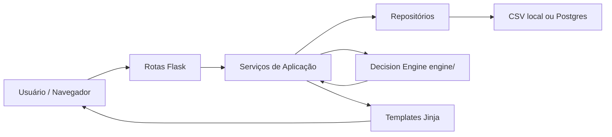

# ROADMAP V5 — FaculdadeMaria

## 1. Status do documento

Este documento define o roadmap técnico vigente do FaculdadeMaria rumo a uma base modular, segura, explicável e visualmente Premium.

Ele deve ser interpretado em conjunto com:

- `ARQUITETURA_V4.md`;
- `DECISION_ENGINE_SPEC.md`;
- `ESTRATEGIA_OPERACIONAL.md`;
- `PRODUCT_VISION.md`;
- `BACKLOG.md`;
- `REGRAS_DO_PROJETO.md`.

Em caso de divergência, a implementação deve ser interrompida e a documentação reconciliada antes de prosseguir.

A ordem operacional vigente de itens do Decision Engine é definida pelo backlog oficial e pela Sprint autorizada.

---

## 2. Objetivo

Evoluir o FaculdadeMaria preservando as funcionalidades existentes e construindo, gradualmente:

- arquitetura limpa;
- baixo acoplamento;
- Decision Engine independente;
- análise sistemática de PUTs;
- IA explicável;
- segurança das alterações;
- dados confiáveis;
- eficiência do capital;
- experiência Premium;
- Radar de Oportunidades útil e auditável.

O roadmap não autoriza implementação automática.

---

## 3. Estado oficial atual

### 3.1 Produto

O produto permanece funcionalmente baseado no monólito Flask existente.

Responsabilidades ainda concentradas em `app.py` incluem:

- rotas;
- acesso a dados;
- cálculos financeiros legados;
- cotações;
- parte da apresentação.

Persistência atual inclui:

- CSV local;
- PostgreSQL quando configurado;
- vestígios de SQLite.

### 3.2 Decision Engine

O novo caminho oficial é:

```text
engine/
```

Fundação atual:

- erros estruturados;
- telemetria local;
- versão centralizada;
- contexto;
- pipeline pass-through;
- provider abstrato;
- testes de isolamento.

O pacote:

```text
motor_ia/
```

é legado isolado.

Regra:

> O roadmap vigente não prevê integrar `motor_ia/` ao Radar. O caminho oficial de evolução analítica é o novo `engine/`.

Qualquer correção, integração, remoção ou refatoração do legado depende de Sprint específica e autorização explícita.

### 3.3 Governança consolidada

O projeto já possui:

- arquitetura oficial;
- especificação técnica do Decision Engine;
- estratégia operacional;
- Product Vision;
- backlog priorizado;
- regras permanentes;
- changelog;
- relatórios de Sprint.

---

## 4. Arquitetura alvo

A evolução continua gradual.

Estrutura conceitual:

```text
app.py
cortex/
  __init__.py
  routes/
    dashboard.py
    operacoes.py
    historico.py
    desempenho.py
    carteira.py
    relatorios.py
    configuracoes.py
    backup.py
    radar.py
  services/
    metricas_service.py
    operacoes_service.py
    cotacoes_service.py
    configuracoes_service.py
    exportacoes_service.py
    radar_service.py
  repositories/
    base_repository.py
    csv_repository.py
    postgres_repository.py
  models/
    operacao.py
    configuracao.py
  utils/
    datas.py
    formatadores.py
    validadores.py
engine/
  core/
  market/
  providers/
  metrics/
  indicators/
  asset_quality/
  filters/
  strategies/
  score/
  ranking/
  probability/
  explain/
  learning/
templates/
static/
data/
motor_ia/              # legado isolado
tests/
docs/
```

A estrutura é alvo conceitual e não autoriza criação automática de módulos.

---

## 5. Fluxo alvo



Regra obrigatória:

> Flask nunca implementa regra analítica do Decision Engine.

A integração ocorre por camada de serviço.

---

## 6. Trilhas de evolução

O projeto possui duas trilhas complementares.

### Trilha A — Decision Engine e Radar Premium

Objetivo:

- construir inteligência operacional;
- analisar PUTs;
- ranquear oportunidades com segurança;
- explicar decisões;
- entregar o Radar Premium.

### Trilha B — Modernização gradual da aplicação existente

Objetivo:

- reduzir responsabilidades de `app.py`;
- criar serviços;
- criar repositórios;
- modularizar rotas;
- padronizar interface;
- melhorar dashboard, backup, exportações e produção.

As trilhas podem evoluir de forma independente quando o acoplamento permitir.

Nenhuma delas autoriza alteração fora de Sprint.

---

## 7. Caminho crítico vigente até o Radar Premium

A sequência preferencial é definida pelo `BACKLOG.md`.

### Sprint Funcional A — Contratos e métricas de PUT

Itens principais:

- `FM-ENG-010`;
- `FM-PUT-010`;
- parte de `FM-DATA-010`.

Objetivos:

- contrato completo de oportunidade;
- validação de entrada;
- campos ausentes explícitos;
- preço líquido;
- desconto sobre mercado;
- ROI bruto;
- ROI líquido;
- ROI anualizado;
- distância do strike;
- DTE;
- capital comprometido;
- eficiência do capital;
- normalização mínima de snapshot.

Critérios:

- independente de Flask;
- sem rede real;
- sem banco;
- funções e contratos testáveis;
- premissas explícitas;
- custos não inventados;
- margem não inventada;
- mesma entrada gera mesma saída analítica.

Resultado:

> O motor passa a representar oportunidades e calcular métricas de PUT de forma auditável.

### Sprint Funcional B — Indicadores e segurança

Itens principais:

- `FM-ENG-020`;
- `FM-RISK-010`;
- `FM-RISK-030`.

Objetivos:

- MM21;
- MM200;
- IFR14;
- Bandas de Bollinger;
- ATR;
- volatilidade histórica;
- filtros mínimos;
- distância do strike ajustada por risco;
- motivos explicáveis de descarte.

Critérios:

- funções puras;
- fixtures determinísticas;
- histórico insuficiente tratado;
- sem acesso direto a rede ou persistência.

### Sprint Funcional C — Qualidade do ativo e estratégia PUT

Itens principais:

- `FM-ASSET-010`;
- `FM-PUT-020`;
- `FM-CAP-010`.

Objetivos:

- qualidade do ativo;
- aceitabilidade do exercício;
- avaliador específico de venda de PUT;
- segurança;
- risco;
- eficiência do capital;
- fatores positivos;
- pontos de atenção.

Princípio:

> Prêmio alto não compensa ativo inadequado para exercício e longo prazo.

### Sprint Funcional D — Score e explicação

Itens principais:

- `FM-SCORE-010`;
- `FM-EXPLAIN-010`;
- `FM-EXPLAIN-040`.

Objetivos:

- Score IA de 0 a 100;
- nota de 0 a 10;
- fatores rastreáveis;
- penalidades explícitas;
- confiança dos dados separada;
- resumo técnico;
- pontos positivos;
- pontos de atenção;
- principal risco;
- motivo da nota.

Regra:

> Score IA não pode resgatar oportunidade inelegível.

### Sprint Funcional E — Ranking e serviço de Radar

Itens principais:

- `FM-RANK-010`;
- `FM-SVC-010`.

Objetivos:

- ranking ajustado ao perfil operacional;
- separação entre elegível, observação, não elegível e dado insuficiente;
- serviço entre Flask e engine;
- nenhum cálculo analítico dentro da rota.

Princípios de ranking:

1. elegibilidade;
2. qualidade do ativo;
3. segurança;
4. Score IA;
5. preço líquido;
6. risco x retorno;
7. eficiência do capital;
8. liquidez;
9. confiança dos dados;
10. desempates configuráveis.

### Sprint Visual F — Radar Premium v1

Itens principais:

- `FM-UI-010`;
- parte de `FM-UI-020`.

Objetivo:

Entregar o primeiro grande resultado visual do novo Decision Engine.

Componentes previstos:

- cabeçalho executivo;
- cards de resumo;
- lista ou tabela de oportunidades;
- Score IA;
- nota 0 a 10;
- badges de risco e liquidez;
- preço líquido;
- ROI bruto, líquido e anualizado;
- distância do strike;
- vencimento;
- pontos positivos;
- pontos de atenção;
- conclusão técnica;
- filtros;
- ordenação;
- estado vazio;
- loading;
- erro amigável;
- responsividade.

Direção visual:

- Premium;
- limpa;
- sofisticada;
- densa sem ser confusa;
- risco visível;
- confiança visível;
- sem precisão fictícia.

---

## 8. Evoluções após o primeiro Radar Premium

### Inteligência de rolagem

Backlog principal:

- detector de PUT aberta;
- lucro capturado;
- prêmio restante;
- custo de recompra;
- comparação com nova oportunidade;
- impacto da margem;
- retorno incremental;
- recomendação manter, fechar ou rolar.

Regra:

> Nunca rolar apenas para adiar prejuízo ou esconder deterioração.

### Comparadores

Evoluções previstas:

- comparação entre strikes;
- comparação entre ativos;
- comparação lado a lado;
- alternativa melhor obrigatória quando objetivamente identificada.

### Gestão de risco

Evoluções previstas:

- spread bid/ask;
- concentração por ativo;
- concentração por vencimento;
- visão de risco da carteira;
- alertas antes da entrada.

### Aprendizado futuro

Somente após:

- histórico de decisões;
- resultados reais;
- critérios validados;
- governança;
- auditoria.

Machine Learning não é prioridade inicial.

---

## 9. Modernização gradual da aplicação existente

Esta trilha preserva objetivos válidos do roadmap anterior.

### 9.1 Estabilização da base

Atividades candidatas:

- mapear rotas;
- identificar templates usados;
- confirmar schemas reais;
- listar funcionalidades que não podem quebrar;
- criar dados de teste;
- levantar divergências CSV/Postgres/SQLite.

### 9.2 Utilitários

Atividades candidatas:

- formatação monetária;
- conversão numérica;
- datas;
- validadores;
- testes puros.

### 9.3 Repositórios

Atividades candidatas:

- contrato de repositório;
- CSV;
- PostgreSQL;
- schema mínimo;
- fallback local.

### 9.4 Serviços

Atividades candidatas:

- métricas;
- operações;
- cotações;
- configurações;
- exportações.

### 9.5 Rotas modulares

Atividades candidatas:

- blueprints;
- migração por domínio;
- preservação de URLs;
- testes de navegação.

### 9.6 Interface existente

Atividades candidatas:

- uso consistente de `base.html`;
- remover HTML gerado em Python;
- padronizar cards e tabelas;
- reduzir estilos inline;
- manter ações e conteúdo.

### 9.7 Dashboard com dados reais

Atividades candidatas:

- históricos reais;
- top 5 real;
- distribuição real por ativo;
- métricas reais;
- estados vazios.

### 9.8 Exportações, backup e produção

Atividades candidatas:

- relatórios coerentes com serviços;
- backup com manifesto;
- documentação local;
- Render/Neon;
- variáveis de ambiente;
- validação de schema.

Nenhuma dessas atividades está autorizada por este roadmap.

---

## 10. Estratégia de não regressão

### Regras de proteção

- não misturar comportamento e grande refatoração sem justificativa;
- manter URLs existentes;
- manter nomes de campos usados por templates durante transição;
- migrar área pequena por vez;
- preservar fallback CSV enquanto oficial;
- criar backup antes de mudança de persistência;
- evitar remover legado sem validação;
- preferir extração antes de reescrita;
- comparar resultados antes e depois.

### Funcionalidades que não podem quebrar

- dashboard;
- cadastro de operação;
- operações abertas;
- edição;
- fechamento;
- reabertura;
- exclusão;
- histórico;
- desempenho;
- carteira;
- configurações;
- backup;
- exportações;
- execução local sem PostgreSQL;
- produção com `DATABASE_URL` quando configurada.

---

## 11. Validação mínima por Sprint

Toda Sprint deve:

- executar testes oficiais aplicáveis;
- validar diff contra `main`;
- listar arquivos alterados;
- confirmar escopo;
- validar regressões;
- atualizar documentação;
- produzir relatório técnico;
- parar para revisão;
- realizar merge apenas após autorização explícita.

Quando houver impacto no fluxo existente, validar manualmente conforme escopo:

1. abrir `/`;
2. abrir `/operacoes-abertas`;
3. criar operação de teste;
4. editar;
5. fechar;
6. conferir `/op-fechadas`;
7. reabrir;
8. conferir `/historico`;
9. conferir `/desempenho`;
10. salvar configurações;
11. testar backup;
12. testar exportações.

Não executar validação irrelevante apenas para produzir aparência de cobertura.

---

## 12. Riscos principais

| Área | Risco | Impacto | Mitigação |
|---|---|---:|---|
| Contratos | Estrutura instável | Alto | Contratos explícitos e testes |
| Métricas PUT | Fórmula ambígua | Alto | Premissas e base de capital declaradas |
| Dados | Dado ausente tratado como zero | Alto | Estado explícito de ausência |
| Qualidade do ativo | Critério subjetivo oculto | Alto | Configuração e explicabilidade |
| Gates | Score compensar falha crítica | Alto | Elegibilidade antes de Score |
| Score | Falsa precisão | Alto | Fatores e confiança separados |
| Ranking | Priorizar prêmio/ROI | Alto | Ordem alinhada ao perfil |
| Provider | Indisponibilidade externa | Alto | Timeout, erro e fallback |
| Interface | Mascarar risco | Alto | Semântica visual clara |
| Persistência | Divergência CSV/Postgres | Alto | Repositórios e schema oficial |
| Rotas | Quebra de URL | Médio | Preservar URLs e migrar por domínio |
| Legado | Integrar módulo incorreto | Alto | `motor_ia/` isolado; `engine/` oficial |

---

## 13. Critérios gerais de conclusão

Uma etapa só pode ser considerada concluída quando:

- escopo autorizado foi cumprido;
- escopo não autorizado permaneceu intacto;
- testes aplicáveis passaram;
- regressões foram avaliadas;
- documentação reflete o estado real;
- diff foi comparado com `main`;
- riscos e pendências foram registrados;
- Product Owner revisou;
- merge foi autorizado quando aplicável.

---

## 14. Versões e releases

A versão do produto não deve avançar automaticamente com Sprints internas.

A versão interna do Decision Engine é independente da versão comercial do produto.

Releases futuras devem possuir:

- objetivo claro;
- critérios de aceite;
- changelog;
- testes;
- documentação;
- decisão explícita.

O roadmap anterior baseado em blocos rígidos `v4.4`, `v4.5`, `v4.6` e `v4.7` é substituído, para a evolução do Decision Engine, pela sequência oficial do backlog e das Sprints Funcionais A–F.

Isso evita associar número de versão a implementação ainda não autorizada.

---

## 15. Definição de sucesso da evolução V5

A evolução V5 será considerada madura quando o FaculdadeMaria possuir, de forma progressiva e validada:

- aplicação existente preservada;
- arquitetura mais modular;
- acesso a dados organizado;
- regras de aplicação em serviços apropriados;
- novo Decision Engine independente;
- contratos estáveis;
- métricas de PUT auditáveis;
- qualidade do ativo;
- gates de segurança;
- Score IA explicável;
- ranking alinhado ao perfil;
- Radar Premium;
- rolagem explicável;
- backup e exportações confiáveis;
- testes suficientes;
- documentação sincronizada;
- deploy validado quando aplicável.

---

## 16. Conclusão

O caminho oficial do FaculdadeMaria combina duas prioridades:

1. construir o novo `engine/` com segurança, explicabilidade e aderência à estratégia de venda sistemática de PUT;
2. modernizar gradualmente a aplicação Flask sem quebrar funcionalidades existentes.

O `motor_ia/` não é o motor a ser integrado ao novo Radar.

O primeiro grande resultado visual futuro é o Radar Premium, sustentado por contratos, métricas, qualidade, segurança, Score, ranking e explicação reais.

A meta não é chegar ao visual mais rápido a qualquer custo.

A meta é chegar a um visual Premium que mereça confiança.